# FillTheLyrics — Canonical Design, Interaction, Motion, and Implementation Spec

**Status:** Canonical implementation reference  
**Version:** 1.1 — graffiti/handwritten accent system expanded  
**Last updated:** 2026-09-11  
**Audience:** Coding agents / frontend workers / reviewers  
**Primary worker assumption:** The implementing worker may be a weaker model. Follow this file literally. Do not reinterpret visual structure unless a requirement is impossible in the existing codebase.  
**Last design direction:** Approved purple–mint editorial music-game direction with consistent gameplay shell.

---

## 0. Read This First

This document is the **source of truth** for the FillTheLyrics redesign implementation.

The implementation should combine:

1. the approved landing page composition, and
2. the normalized state set for pre-start, gameplay, celebration overlays, round-complete states, and final results.

Do **not** treat each reference image as a separate poster or separate product. The product must feel like **one application stage transforming between states**.

If this document conflicts with a small visual detail in a generated reference image, **this document wins**.

### Priority order

When deciding what to implement, use this priority:

1. **Gameplay/product logic in this document**
2. **Canonical layout/state rules in this document**
3. **Semantic color/state rules in this document**
4. **Canonical reference images**
5. Decorative details in the images

Do not invent new navigation, new gameplay mechanics, new hints, new cards, or new screens.

---

# 1. Canonical Visual References

## 1.1 Landing page — canonical composition

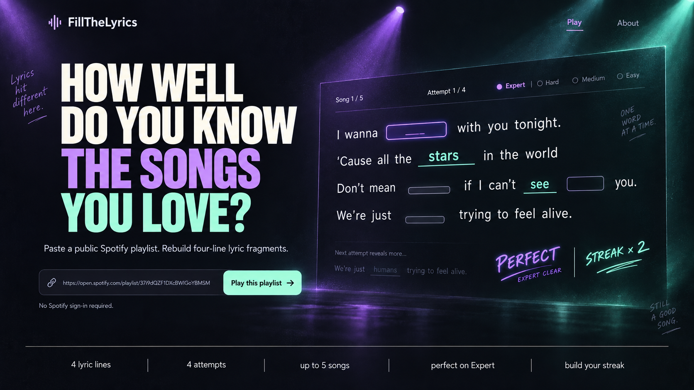

This image defines the overall landing-page composition, atmosphere, stage lighting, hero-to-game-preview relationship, and the use of handwritten annotations.

**Important:** The current headline wording is temporary. Preserve the composition and typography hierarchy, not necessarily the exact sentence.

## 1.2 Canonical desktop state board

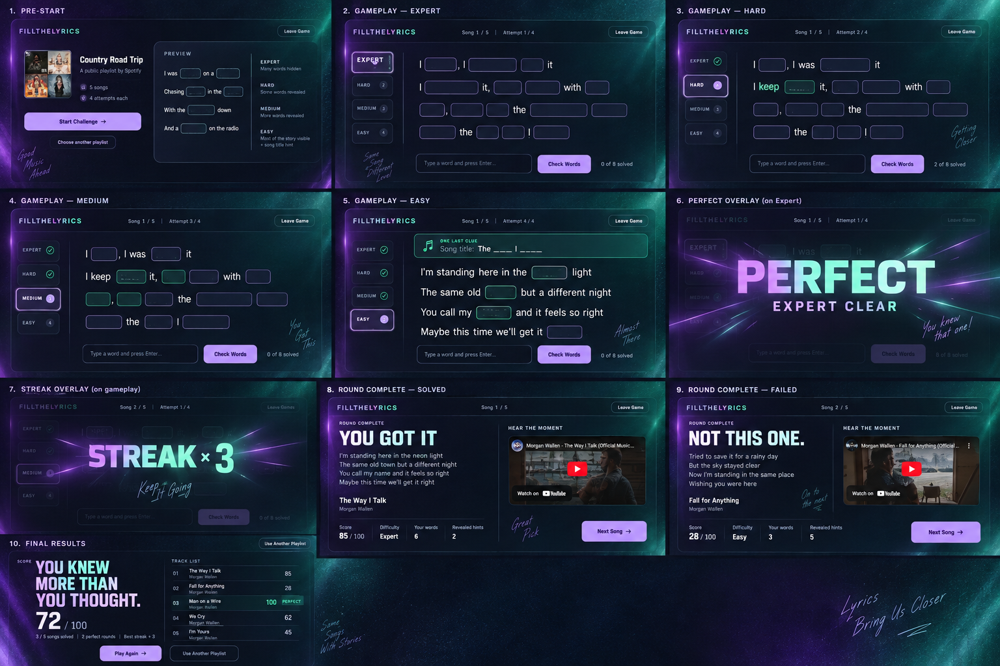

This board is the canonical desktop reference for the remaining product states.

Individual state crops are included below for easier implementation.

### Pre-start

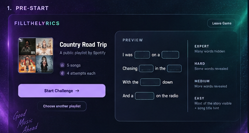

### Gameplay — Expert

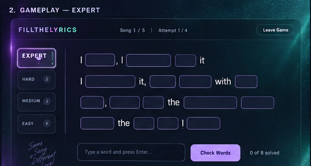

### Gameplay — Hard

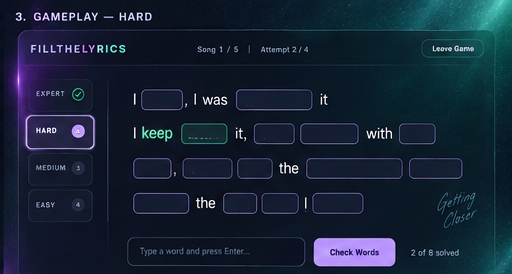

### Gameplay — Medium

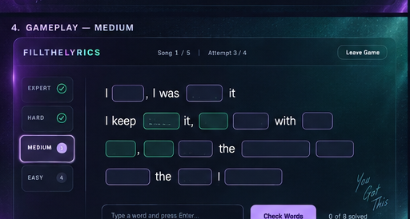

### Gameplay — Easy

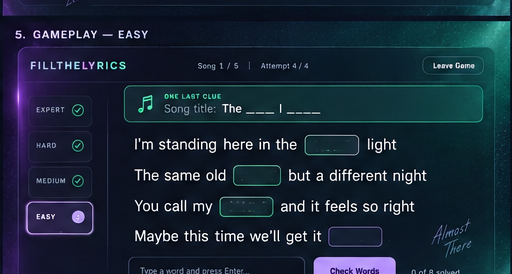

### PERFECT overlay

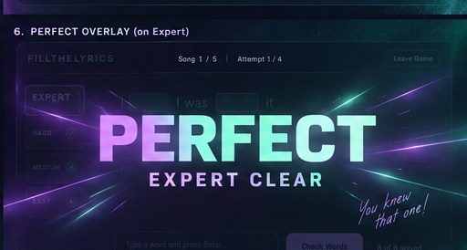

### STREAK overlay

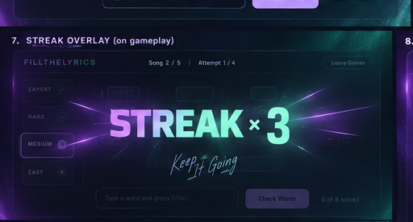

### Round complete — solved

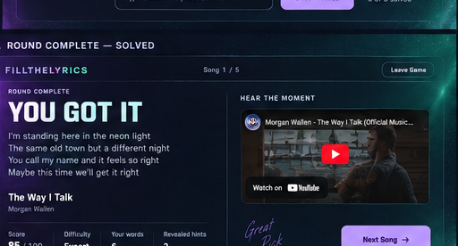

### Round complete — failed

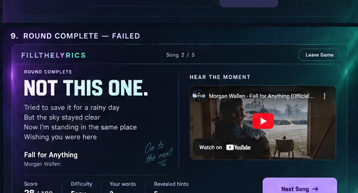

### Final results

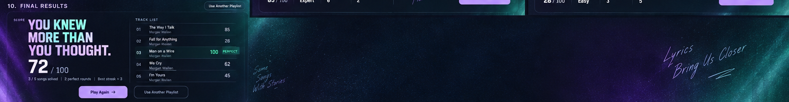

---

# 2. Product Flow and Route Model

Implement **four main routes/views**, not eleven independent pages.

```text
/                  Landing
/play/setup        Pre-start / playlist ready
/play              Active game + all gameplay states + overlays + round complete
/results           Final challenge results
```

Inside `/play`, state changes should happen without changing page architecture.

```text
PLAY
├── expert
├── hard
├── medium
├── easy
├── perfect overlay
├── streak overlay
├── round complete / solved
└── round complete / failed
```

Do not create separate route components such as:

```text
/play/expert
/play/hard
/play/medium
/play/easy
/play/perfect
```

unless the existing routing architecture strictly requires it. Prefer a single gameplay route with state-driven rendering.

---

# 3. Non-Negotiable Gameplay Rules

These are product rules, not visual suggestions.

## 3.1 Per-song structure

- Exactly **4 consecutive lyric lines** are used per question.
- Some complete words are hidden.
- Punctuation stays visible.
- The player has **4 attempts**.

## 3.2 Difficulty progression

```text
Attempt 1 → Expert
Attempt 2 → Hard
Attempt 3 → Medium
Attempt 4 → Easy
```

Difficulty is based on **progressive complete-word reveal**.

### Expert

- Most difficult.
- Many complete words are hidden.
- No song-title hint.

### Hard

- Triggered after an unsuccessful Expert submission.
- Some complete hidden words are revealed by the system.

### Medium

- More complete words are revealed.

### Easy

- Most contextual words are visible.
- Remaining unresolved words are still playable.
- A song-title hint appears.

## 3.3 Explicitly forbidden hint mechanics

Do **not** implement:

- first-letter hints,
- letter-by-letter reveal,
- Hangman-style mechanics,
- changing a blank into partial spelling,
- different puzzle rules per difficulty.

The only difficulty change is **how many complete words remain hidden**, plus the song-title hint on Easy.

## 3.4 Correct words

- Correctly guessed words become permanently locked.
- Locked words stay solved through all later attempts.
- Locked words are visually distinct from system-revealed hints.

## 3.5 Round completion

A round ends when either:

1. all unresolved lyric words are solved, or
2. all 4 attempts are consumed.

After the round ends:

- reveal the complete 4-line lyric fragment,
- reveal song title and artist,
- show performance stats,
- show the relevant YouTube player.

The YouTube player **must never appear during active gameplay**.

## 3.6 PERFECT

A round is `PERFECT` when the player solves the song during **Attempt 1 / Expert**.

PERFECT is a celebration state, not a separate page.

## 3.7 STREAK

A streak counts consecutive successfully solved songs.

- solved song → streak increments,
- failed song → streak resets according to existing game logic,
- do not invent a new scoring formula in this redesign.

Preserve any existing backend/domain scoring logic unless explicitly replaced elsewhere.

---

# 4. Visual Identity — Locked

The FillTheLyrics visual identity is:

> **Editorial music game + concert-stage atmosphere + lyric reconstruction interface**

It should not look like:

- SaaS software,
- an admin dashboard,
- a developer tool,
- a crypto interface,
- a cyberpunk template,
- a Spotify clone,
- a generic AI-generated landing page.

The UI should feel authored specifically for a lyric game.

---

# 5. Core Visual Language

## 5.1 Background

Base background must be **deep navy-charcoal**, not pure black.

Recommended base tokens:

```css
:root {
  --ftl-bg: #090b14;
  --ftl-bg-raised: #0f1320;
  --ftl-surface: rgba(18, 23, 36, 0.72);
  --ftl-surface-strong: rgba(20, 26, 40, 0.90);
}
```

## 5.2 Stage lighting

Use two clear light sources:

```text
LEFT / UPPER-LEFT
purple / violet stage lighting

RIGHT / UPPER-RIGHT
mint / teal stage lighting

CENTER
mostly dark / neutral for readability
```

Lighting should resemble concert-stage beams, not random gradient blobs.

Suggested semantic colors:

```css
:root {
  --ftl-purple: #bb78ff;
  --ftl-purple-soft: #c9a4ff;

  --ftl-mint: #72efc5;
  --ftl-mint-soft: #8fdabc;

  --ftl-text: #f4f2f7;
  --ftl-text-muted: #9493a4;
  --ftl-text-subtle: #686979;

  --ftl-border: rgba(215, 218, 238, 0.16);
  --ftl-border-active: rgba(198, 153, 255, 0.78);
}
```

These values are implementation defaults. Small tuning is allowed if contrast requires it, but preserve the semantic roles below.

## 5.3 Color semantics

Use colors semantically, not randomly.

| Meaning | Treatment |
|---|---|
| Current interaction / focus | Purple / lavender |
| Player-solved word | Bright mint |
| System-revealed hint | Softer / muted mint |
| Static lyric | Off-white |
| Secondary metadata | Cool muted grey |
| Normal mistakes | No aggressive bright red |

Do not decorate arbitrary words with purple/mint just because the design looks empty.

## 5.4 Grain / texture

Use a very subtle grain overlay, approximately equivalent to 2–3% visual intensity.

Texture should:

- prevent the background from feeling sterile,
- support the concert/editorial atmosphere,
- never reduce lyric readability.

## 5.5 Decorative venue objects

If using scenic elements such as:

- speaker/amplifier silhouettes,
- guitar cases,
- posters,
- stage floor reflections,
- light rigs,

keep them in a **decorative background layer**.

They must not be required for layout or interaction.

On smaller screens, these elements can be hidden entirely.

---

# 6. Typography — Locked Roles

Use at most **three typographic voices**.

## 6.1 Display type

Use a bold condensed grotesk for:

- landing hero,
- PERFECT,
- STREAK,
- results headline,
- large celebration moments.

If the project has no appropriate display font yet, a practical implementation default is a condensed Google-font-style family such as `Bebas Neue`, `Anton`, or a visually similar condensed display face. Choose **one**, not several.

## 6.2 UI / lyric type

Use a clean contemporary sans-serif for:

- lyric text,
- body text,
- buttons,
- metadata,
- game labels,
- song information,
- input text,
- stats.

Recommended default if a new font is needed:

```text
Instrument Sans
```

Do not use monospace as a major UI voice.

## 6.3 Graffiti / handwritten accent system — locked

The handwritten graffiti is a **signature atmospheric device** for FillTheLyrics. It is not filler copy and not a substitute for UI labels. Treat it as a reusable visual system with strict rules.

### 6.3.1 Purpose

Graffiti exists to add:

- a human, music-zine feeling,
- intimacy and personality,
- a subtle sense that the stage has been written on by players/listeners,
- emotional punctuation around otherwise clean UI.

Graffiti must **never carry required product information**. A user should be able to hide every graffiti note and still understand and use the full game.

### 6.3.2 Typeface / stroke

Use **one** loose handwritten / marker-like family throughout the product. Do not mix several handwriting fonts.

Desired qualities:

- casual but legible,
- slightly imperfect baseline,
- marker / pencil / stage-note character,
- not childish, comic, bubbly, or graffiti-tag aggressive,
- not a script font used for long paragraphs.

Optional embellishments:

- one short underline,
- one double-stroke underline,
- a small arrow or slash,
- tiny hand-drawn emphasis marks.

Do not add illustrated doodles that compete with gameplay.

### 6.3.3 Color and opacity

Use only approved palette colors:

```css
:root {
  --ftl-graffiti-purple: rgba(187, 120, 255, 0.72);
  --ftl-graffiti-mint: rgba(114, 239, 197, 0.72);
  --ftl-graffiti-neutral: rgba(244, 242, 247, 0.48);
}
```

Default opacity target: **45–80%** depending on background contrast.

Rules:

- graffiti must be lower contrast than primary lyrics and buttons,
- do not use a stronger glow than active gameplay UI,
- no filled background card behind graffiti,
- no heavy text shadow,
- no red/orange warning treatment.

### 6.3.4 Rotation and scale

Default rotation range:

```text
-8deg to +8deg
```

A rare accent may exceed this slightly, but avoid dramatic diagonal text.

Recommended desktop size:

```text
18–32px equivalent
```

Graffiti should not become as large as a UI heading.

### 6.3.5 Placement

Good placements:

- outer page margins,
- negative space beside the lyric stage,
- near a purple/mint light beam,
- beside PERFECT/STREAK without covering the main typography,
- low-priority corners of Round Complete / Results,
- around decorative venue imagery.

Forbidden placements:

- over lyric gaps,
- over buttons,
- over shared input controls,
- over YouTube controls or thumbnail focal point,
- over difficulty labels,
- inside the main reading path of four lyric lines,
- where it could be mistaken for an instruction or clickable element.

Maintain a minimum visual buffer around interactive content. As an implementation default, keep graffiti at least **24px** away from interactive controls and at least **32px** away from active lyric gaps where practical.

### 6.3.6 Density per screen

Do not fill every viewport with handwritten slogans. Use these maximum targets:

| Screen/state | Maximum visible graffiti | Notes |
|---|---:|---|
| Landing | 3 | Can use both sides if composition remains balanced |
| Pre-start | 2 | Prefer one near each atmospheric side |
| Gameplay | 2 | Never in lyric reading path |
| PERFECT overlay | 1 supporting note | PERFECT remains dominant |
| STREAK overlay | 1 supporting note | STREAK remains dominant |
| Round Complete | 2 | Keep YouTube area clean |
| Final Results | 3 | May sit around scenic background |
| Mobile | 0–1 | Hide before shrinking to unreadable size |

These are maxima, not targets. Zero graffiti is acceptable if the screen is already visually busy.

### 6.3.7 Copy style

Graffiti copy must be:

- short, usually **2–5 words**,
- emotionally direct,
- music/game-adjacent,
- human-sounding,
- optional and non-instructional.

Prefer copy related to the immediate game state. Examples that fit the system:

```text
Keep going
Almost there
You knew that one
One word at a time
Same song, closer
Right on
Good pick
On a roll
That’s the one
Close one
Try the next line
Still a good song
```

These examples are a tone reference, not mandatory strings.

Avoid generic AI-slogan copy such as:

```text
Music connects us
Good music better days
Same songs different people
Music lives in the details
Lyrics bring us closer
Better lyrics brighter days
```

These phrases may appear in old image references. **Do not treat them as canonical copy.** Replace them with shorter, state-aware alternatives or omit them.

Also avoid:

- motivational paragraphs,
- brand mission statements,
- repeated slogans across multiple pages,
- instructions already expressed by UI,
- fake quotes or testimonials.

### 6.3.8 State-aware copy guidance

Use context when choosing a note:

```text
Landing       → curiosity / challenge
Pre-start     → anticipation
Expert        → confidence / focus
Hard/Medium   → encouragement / getting closer
Easy          → almost there / final clue
PERFECT       → recognition, not extra hype
STREAK        → momentum
Solved        → acknowledgement
Failed        → warm continuation, never punishment
Results       → reflection / replay energy
```

Do not show failure-shaming copy.

### 6.3.9 Interaction and accessibility

Graffiti is decorative:

- render with `aria-hidden="true"` when it contains no required information,
- do not include it in tab order,
- do not make it clickable unless a future feature explicitly requires it,
- use `pointer-events: none`,
- do not duplicate important text in graffiti.

If implemented as real text rather than a background image, it should not interfere with text selection or form controls.

### 6.3.10 Responsive behavior

Graffiti is expendable before core UI.

Breakpoint behavior:

- desktop: use full intended density,
- tablet: reduce count and move notes away from tighter content,
- mobile: keep at most one small note if there is clear negative space; otherwise hide all graffiti.

Never shrink graffiti until it becomes unreadable just to preserve it.

### 6.3.11 Implementation contract

Recommended reusable component:

```ts
export interface HandwrittenAnnotationProps {
  text: string;
  tone?: 'purple' | 'mint' | 'neutral';
  size?: 'sm' | 'md' | 'lg';
  rotateDeg?: number; // clamp to roughly -8..8 by default
  underline?: 'none' | 'single' | 'double';
  className?: string;
}
```

Expected behavior:

- `pointer-events: none`,
- decorative by default,
- no layout dependency on annotation size,
- absolute positioning is acceptable inside a dedicated decorative layer,
- hide/reduce via responsive utilities without affecting surrounding layout.

Example:

```tsx
<HandwrittenAnnotation
  text="Almost there"
  tone="mint"
  rotateDeg={-5}
  underline="single"
  className="hidden lg:block absolute right-8 top-1/3"
/>
```

### 6.3.12 Anti-drift rule

If the coding agent is unsure whether a new graffiti note is needed, **omit it**. Graffiti is a signature accent because it is sparse. Adding more notes is not a valid way to make a screen feel more branded.

## 6.4 Suggested type scale

```css
:root {
  --ftl-text-xs: 12px;
  --ftl-text-sm: 14px;
  --ftl-text-base: 16px;
  --ftl-text-lg: 20px;

  --ftl-lyric-size: clamp(26px, 2vw, 34px);
  --ftl-heading-md: clamp(36px, 4vw, 56px);
  --ftl-display-size: clamp(72px, 8vw, 128px);
}
```

Treat these as starting tokens. Maintain relative hierarchy across breakpoints.

---

# 7. Global Layout Tokens

Recommended baseline:

```css
:root {
  --ftl-page-max: 1440px;
  --ftl-page-pad-x: clamp(24px, 5vw, 80px);

  --ftl-header-h: 84px;

  --ftl-game-rail-w: 180px;
  --ftl-game-gap: 36px;

  --ftl-stage-max-w: 980px;
  --ftl-stage-min-h: 520px;

  --ftl-radius-sm: 8px;
  --ftl-radius-md: 14px;
  --ftl-radius-lg: 20px;
}
```

Do not use 24–32px border radius on every component.

Use:

- small radius for controls,
- medium radius for inputs/buttons,
- large radius only for major stage surfaces.

---

# 8. Landing Page

Route:

```text
/
```

Use `canonical-landing.png` as the composition benchmark.

## 8.1 Desktop structure

```text
┌─────────────────────────────────────────────────────────────┐
│ Brand                                      minimal nav       │
│                                                             │
│ HERO LEFT                     GAMEPLAY PREVIEW RIGHT         │
│                                                             │
│ large headline                angled lyric stage            │
│ short product sentence        4 lyric lines                 │
│ Spotify URL input             attempt/difficulty state      │
│ CTA                           PERFECT/STREAK hint            │
│                                                             │
├─────────────────────────────────────────────────────────────┤
│ 4 lyric lines | 4 attempts | up to 5 songs | perfect | ... │
└─────────────────────────────────────────────────────────────┘
```

## 8.2 Landing behavior

Input:

- accepts public Spotify playlist URL,
- user can paste directly,
- primary CTA starts import/validation flow.

Do not require Spotify sign-in for the public playlist flow.

## 8.3 Landing preview

The right-side lyric stage is a **visual gameplay demonstration**, not the actual current game state.

It may animate through:

1. hidden gaps,
2. a typed answer,
3. a correct word locking,
4. a hint revealing,
5. a short PERFECT/STREAK teaser.

Do not let this preview contain real user game state.

## 8.4 Landing copy

The current hero wording in the image is **not locked**.

Do not block implementation on final copywriting. Build the layout to support a large multi-line hero.

---

# 9. Pre-Start / Playlist Ready

Route:

```text
/play/setup
```

Canonical reference:

```text
./assets/01-pre-start.png
```

## 9.1 Purpose

The playlist has been imported and validated. The user is about to start the challenge.

## 9.2 Required information

Show:

- playlist / album identity,
- track or challenge count,
- 4 attempts each,
- a short explanation of progressive reveal,
- Start Challenge,
- Choose another playlist.

## 9.3 Do not leak challenge answers

Do not reveal full upcoming song answers or all actual selected song titles if the current product intends to preserve surprise.

If current backend already exposes a playlist track list on setup, this is optional display information; do not make it required to start.

## 9.4 Difficulty explanation

Use one lyric fragment and visually communicate:

```text
Expert  → many words hidden
Hard    → some complete words revealed
Medium  → more complete words revealed
Easy    → most context visible + song-title hint
```

Do not use four generic feature cards.

---

# 10. Active Gameplay Shell — Single Canonical Layout

Route:

```text
/play
```

All Expert / Hard / Medium / Easy states use the same geometry.

## 10.1 Header

During active gameplay, header contains only:

```text
FillTheLyrics
Song X / N
Attempt X / 4
Leave Game
```

Do not show during an active challenge:

- Home,
- Leaderboard,
- Community,
- Results,
- How It Works.

## 10.2 Desktop structure

```text
┌──────────────────────────────────────────────────────────────┐
│ FillTheLyrics      Song 1/5      Attempt 1/4     Leave Game │
├──────────────────────────────────────────────────────────────┤
│                                                              │
│  difficulty rail   lyric stage                               │
│                                                              │
│  ● EXPERT          No, I ______ hide it                      │
│  │                                                           │
│  ○ HARD            I don't _____ it, I just ____ with it    │
│  │                                                           │
│  ○ MEDIUM          Oh, kinda ____ like the ______ rolls      │
│  │                                                           │
│  ○ EASY            It's the only ____ I know                 │
│                                                              │
│                    shared input + Check Words                 │
└──────────────────────────────────────────────────────────────┘
```

## 10.3 Critical consistency rule

When difficulty changes:

**Do not move**:

- header,
- difficulty rail,
- lyric stage,
- action row,
- primary button.

Only change:

- active difficulty marker,
- visible lyric information,
- hint count,
- atmosphere intensity,
- Easy title hint.

---

# 11. Difficulty Rail

The rail is a reusable component.

Suggested API:

```ts
type Difficulty = 'expert' | 'hard' | 'medium' | 'easy';

interface DifficultyRailProps {
  current: Difficulty;
  completed: Difficulty[];
  attempt: 1 | 2 | 3 | 4;
}
```

Display order never changes:

```text
EXPERT
HARD
MEDIUM
EASY
```

State styles:

- current → lavender/purple emphasis,
- completed → subdued mint confirmation,
- upcoming → muted neutral,
- do not make each row look like a large dashboard card.

---

# 12. Lyric Stage and Word State Model

This is the most important component in the application.

## 12.1 Required semantic states

Use explicit states in code. Do not infer state from CSS class names only.

```ts
type LyricWordState =
  | 'static'
  | 'hidden'
  | 'focused'
  | 'draft'
  | 'solved'
  | 'revealed';
```

## 12.2 State rendering

### `static`

- plain off-white lyric text,
- no border,
- not clickable.

### `hidden`

- unresolved interactive lyric gap,
- outlined neutral/lavender-tinted surface,
- width approximately corresponds to lexical length,
- no answer in `aria-label`, title, placeholder, data attribute, hidden DOM, or visually hidden text.

### `focused`

- unresolved active gap,
- lavender border,
- subtle glow,
- accessible focus indication.

### `draft`

- temporary user-entered text associated with a gap,
- readable but not yet locked,
- must not use mint success styling.

### `solved`

- player solved this word,
- render as **plain bright-mint text**,
- remove input-like container,
- permanently locked.

### `revealed`

- system revealed this word as a hint,
- render as **plain softer-mint text**,
- no permanent box/capsule,
- visually distinct from player-solved word.

## 12.3 Important correction to image references

Some generated images show mint words inside green capsules. Do **not** implement that as the final semantic state.

Final canonical rule:

```text
Only unresolved interactive words look like gaps/boxes.
Solved and revealed words are plain lyric text.
```

## 12.4 Gap width

Do not use one fixed width for every blank.

Suggested approximation:

```ts
const widthCh = clamp(wordLength + 1, 3, 12);
```

or server-provided placeholder width if already available.

Example CSS approach:

```css
.lyric-gap {
  inline-size: calc(var(--word-ch) * 0.72em + 1.5rem);
  min-inline-size: 3.2rem;
  max-inline-size: 12rem;
}
```

Do not expose the correct answer client-side only to calculate width if the game currently protects answers from the DOM.

---

# 13. Shared Input UX — Locked Recommendation

Use a shared input below the lyric stage for MVP consistency and accessibility.

Interaction:

```text
1. user clicks/tabs to a hidden lyric gap
2. gap becomes focused
3. shared input becomes associated with that gap
4. user types a draft
5. Enter commits draft to current gap OR moves to next unresolved gap
6. Check Words submits all current drafts
```

Required behavior:

- if no gap is focused and input receives text, focus the first unresolved gap,
- solved/revealed words cannot be edited,
- preserve drafts when moving between gaps before submission,
- input value must not leak the actual answer,
- keyboard-only navigation must work.

Suggested component split:

```tsx
<LyricStage>
  <LyricLine>
    <LyricWord />
    <LyricGap />
  </LyricLine>
</LyricStage>

<AnswerComposer
  activeGapId={activeGapId}
  drafts={drafts}
  onDraftChange={...}
  onCommit={...}
/>
```

---

# 14. Submission Behavior

Primary action label:

```text
Check Words
```

On submission:

1. evaluate drafted unresolved words,
2. correct guesses → `solved`,
3. incorrect guesses → return to unresolved state,
4. if every answer is solved → finish round,
5. otherwise if attempts remain → advance difficulty and reveal system hints,
6. if no attempts remain → finish as failed.

Do not navigate away during the Expert → Hard → Medium → Easy transition.

---

# 15. Easy State / Song-Title Hint

Easy is still the exact same gameplay shell.

It adds one title-hint region, preferably inside the lyric-stage header area.

Suggested component:

```tsx
<SongTitleHint
  visible={difficulty === 'easy'}
  maskedTitle={...}
/>
```

The hint is additional information, not a replacement for lyrics.

Do not automatically solve remaining lyric gaps when showing the title hint.

---

# 16. PERFECT Overlay

Reference:

```text
./assets/06-perfect-overlay.png
```

PERFECT is an overlay over the existing gameplay shell.

Do not render a new route.

Suggested API:

```tsx
<CelebrationOverlay
  type="perfect"
  label="PERFECT"
  sublabel="EXPERT CLEAR"
/>
```

Gameplay remains visible, slightly dimmed/blurred, underneath.

Do not use:

- confetti,
- trophies,
- star explosions,
- emoji,
- achievement cards.

---

# 17. STREAK Overlay

Reference:

```text
./assets/07-streak-overlay.png
```

STREAK is also an overlay.

Suggested API:

```tsx
<CelebrationOverlay
  type="streak"
  value={3}
/>
```

Render:

```text
STREAK × 3
```

Do not build a heavy 3D mechanical counter unless the project already has an appropriate motion/3D layer.

A typographic number reel with CSS/Framer Motion is preferred.

---

# 18. Round Complete — Single Architecture

References:

```text
./assets/08-round-complete-solved.png
./assets/09-round-complete-failed.png
```

Solved and failed states must use the same component architecture.

Suggested API:

```ts
type RoundOutcome = 'solved' | 'failed';

interface RoundCompleteProps {
  outcome: RoundOutcome;
  lyrics: LyricLine[];
  songTitle: string;
  artist: string;
  score: number;
  difficultyReached: Difficulty;
  solvedByUser: number;
  revealedAsHints: number;
  attemptsUsed: number;
  youtubeId?: string;
}
```

## 18.1 Desktop layout

```text
┌────────────────────────────────────────────────────────────┐
│ LEFT ~55%                         RIGHT ~45%                │
│                                                            │
│ ROUND COMPLETE                    HEAR THE MOMENT           │
│ YOU GOT IT / NOT THIS ONE         [ YouTube player ]        │
│                                                            │
│ complete 4-line lyrics                                     │
│ Song Title — Artist                                        │
│                                                            │
│ score / difficulty / solved / hints      actions           │
└────────────────────────────────────────────────────────────┘
```

The YouTube player is **always on the right on desktop**.

Do not place it below the lyrics in one variant and beside the lyrics in another.

## 18.2 Solved vs failed

Only these change:

- headline,
- score/performance values,
- success emphasis,
- copy.

Architecture, spacing, video position, and action placement stay the same.

## 18.3 Required actions

Primary:

```text
Next Song
```

Secondary, if implemented:

```text
Replay Video
```

Keep their positions stable between solved/failed outcomes.

---

# 19. YouTube Player Rules

The YouTube player is a **post-round reward**.

Do not show it:

- on landing as real gameplay playback,
- on pre-start,
- during Expert/Hard/Medium/Easy active gameplay.

Show it only after the round completes.

If autoplay is blocked by browser policy, show the player ready to play and preserve accessible controls.

Do not make game completion depend on playback success.

---

# 20. Final Results

Route:

```text
/results
```

Reference:

```text
./assets/10-final-results.png
```

## 20.1 Structure

```text
LEFT
large performance headline
large final score
songs solved
perfect rounds
best streak

RIGHT
vertical track list
per-song score
optional PERFECT marker

ACTIONS
Play Again
Use Another Playlist
```

## 20.2 Track list

Do not create a giant card per song.

Use a compact editorial track-list structure.

Suggested row model:

```ts
interface ResultTrackRow {
  index: number;
  title: string;
  artist: string;
  score: number;
  perfect: boolean;
  solved: boolean;
}
```

## 20.3 Decorative environment

Venue scenery may be shown in the background only.

Do not position interactive elements based on decorative objects.

---

# 21. Responsive Rules

## 21.1 Breakpoints

Suggested implementation breakpoints:

```text
>= 1280px    desktop / large desktop
1024–1279px  compact desktop / tablet landscape
768–1023px   tablet
< 768px      mobile
```

These can map to the project’s existing Tailwind breakpoints if already configured.

## 21.2 Mobile landing

Order:

```text
Brand
Hero
Short copy
Playlist input
CTA
Gameplay preview
Rules strip
```

Do not force the desktop two-column hero onto narrow screens.

## 21.3 Mobile gameplay

Difficulty rail becomes compact horizontal progression:

```text
EXPERT — HARD — MEDIUM — EASY
```

Then:

```text
Song X/N
Attempt X/4
4 lyric lines
shared input
Check Words
```

Lyrics must remain readable. Do not shrink lyric text until it resembles metadata.

## 21.4 Mobile Round Complete

Stack exactly:

```text
round headline
complete lyrics
song info
stats
YouTube player
Next Song
Replay Video (secondary)
```

## 21.5 Mobile Results

Stack:

```text
headline
score
summary
track list
actions
```

Decorative stage elements may be hidden.

---

# 22. Motion System — Global Tokens

The static references are **keyframes**, not complete motion definitions.

Use these timing categories:

```ts
export const motionDuration = {
  micro: 0.16,
  ui: 0.28,
  state: 0.50,
  celebration: 1.50,
};
```

Recommended primary easing:

```css
cubic-bezier(0.22, 1, 0.36, 1)
```

Suggested Framer Motion spring for counters:

```ts
const counterSpring = {
  type: 'spring',
  stiffness: 300,
  damping: 24,
};
```

Do not animate every decorative element simultaneously.

Gameplay motion must prioritize clarity and responsiveness.

---

# 23. Correct Word Motion

Target sequence:

```text
0ms       player submits
0–80ms    active gap outline brightens
80–220ms  correct word appears: y 6px → 0, opacity 0 → 1
120–300ms mint glow peaks briefly
300ms      container/outline disappears
final      plain bright-mint locked text
```

Important final state:

```text
SOLVED WORD = TEXT, NOT A GREEN CAPSULE
```

---

# 24. Incorrect Word Motion

Target:

```text
0ms       submission
60–180ms  subtle x shake: 0 → -4 → 4 → -2 → 0
180–260ms invalid draft fades
260ms     returns to unresolved gap
```

Do not use a large red error flash.

---

# 25. System Hint Reveal Motion

Target:

```text
0–160ms    unresolved content settles
160–380ms  newly revealed complete words fade upward
            opacity 0 → 1
            y 4px → 0
200–500ms  ambient mint intensity increases slightly
```

Final state is plain soft-mint text.

---

# 26. Difficulty Transition Motion

Expert → Hard → Medium → Easy uses no page transition.

Sequence:

```text
0ms        Check Words submitted
0–180ms    incorrect drafts resolved
180–420ms  new complete-word hints reveal
260–480ms  difficulty marker advances
300–550ms  stage lighting subtly shifts purple → mint
550ms      next attempt is interactive
```

Suggested lighting intensity by state:

```text
Expert   purple 100% | mint 30%
Hard     purple 85%  | mint 45%
Medium   purple 65%  | mint 65%
Easy     purple 45%  | mint 85%
Solved   purple 55%  | mint 100%
```

These percentages are conceptual intensity targets, not literal CSS opacity requirements.

---

# 27. PERFECT Motion

Target sequence:

```text
0ms        last correct word locks
0–220ms    four lyric lines tighten vertically slightly
180–420ms  purple → mint horizontal light sweep
320–760ms  PERFECT enters: scale .88 → 1.05 → 1
520–900ms  EXPERT CLEAR fades in
900–1400ms hold
1400–1800ms overlay fades
then        round-complete state appears
```

The gameplay shell stays visible underneath.

---

# 28. STREAK Motion

Target:

```text
0ms        round solved / streak updated
0–200ms    STREAK label enters
150–600ms  counter reels to new number
600–950ms  mint sweep / subtle emphasis
950–1400ms hold
1400–1650ms fade out
```

Implement number roll using vertical translate or similar simple browser-native animation.

Do not require 3D rendering.

---

# 29. Round Complete Transition Motion

Prefer a transformation of the gameplay stage instead of an abrupt hard cut.

```text
0–250ms    remaining unresolved gaps fade
200–500ms  complete lyrics reveal
350–650ms  song title + artist appear
500–800ms  stage expands / reorganizes into split layout
650–950ms  YouTube region enters from right
900–1100ms Next Song becomes active
```

If implementation complexity is high, use a simpler crossfade but preserve the final canonical layout.

---

# 30. Next Song Transition

Signature concept:

```text
current four lyric lines
→ compress into four horizontal lines
→ slide upward
→ new four lyric lines expand in
```

Target duration:

```text
600–800ms
```

This transition should be skipped/reduced when reduced-motion preference is active.

---

# 31. Reduced Motion

Support:

```css
@media (prefers-reduced-motion: reduce)
```

Reduced-motion behavior:

- disable large scale transforms,
- disable perspective motion,
- disable fast light sweeps,
- disable reel-style number motion,
- use simple 100–150ms opacity transitions,
- never make understanding game state dependent on animation.

---

# 32. Component Contract

Recommended component structure:

```text
components/
  fillthelyrics/
    AppShell
    StageAtmosphere
    BrandWordmark
    PlaylistUrlForm
    GameplayPreview
    DifficultyRail
    GameHeader
    LyricStage
    LyricLine
    LyricWord
    LyricGap
    AnswerComposer
    SongTitleHint
    CelebrationOverlay
    RoundComplete
    YoutubeReveal
    ResultSummary
    ResultTrackList
    ResultTrackRow
    HandwrittenAnnotation
```

`HandwrittenAnnotation` is a decorative primitive, not a content component. Follow Section 6.3 exactly; it must not affect primary layout, interaction, accessibility flow, or game logic.

Do not create duplicate screen-specific components for the same concept.

Bad:

```text
ExpertLyricBox
HardLyricBox
MediumLyricBox
EasyLyricBox
```

Good:

```text
LyricStage + difficulty/state props
```

---

# 33. Suggested TypeScript Domain Types

Adapt to existing domain models instead of duplicating them if equivalents already exist.

```ts
export type Difficulty = 'expert' | 'hard' | 'medium' | 'easy';

export type LyricWordState =
  | 'static'
  | 'hidden'
  | 'focused'
  | 'draft'
  | 'solved'
  | 'revealed';

export interface LyricToken {
  id: string;
  display: string;
  punctuation?: string;
  state: LyricWordState;
  placeholderLength?: number;
}

export interface LyricLine {
  id: string;
  tokens: LyricToken[];
}

export interface RoundStats {
  score: number;
  solvedByUser: number;
  revealedAsHints: number;
  attemptsUsed: number;
  difficultyReached: Difficulty;
  perfect: boolean;
}

export interface SongResult {
  songId: string;
  title: string;
  artist: string;
  score: number;
  solved: boolean;
  perfect: boolean;
}
```

**Security note:** Do not place correct hidden answers in arbitrary DOM attributes for styling or accessibility convenience.

---

# 34. Suggested Gameplay UI State Machine

Prefer explicit state over scattered booleans.

```ts
export type GamePhase =
  | 'playing'
  | 'celebrating-perfect'
  | 'celebrating-streak'
  | 'round-complete'
  | 'transitioning-next-song'
  | 'challenge-complete';
```

Example high-level state:

```ts
interface GameUiState {
  phase: GamePhase;
  songIndex: number;
  questionCount: number;
  attempt: 1 | 2 | 3 | 4;
  difficulty: Difficulty;
  activeGapId: string | null;
  drafts: Record<string, string>;
  streak: number;
}
```

Do not represent PERFECT as a route.

---

# 35. Background / Atmosphere Implementation

Prefer CSS/pseudo-element layers over a huge raster image for every screen.

Suggested layer order:

```text
z -4 base navy background
z -3 purple left light
z -3 teal right light
z -2 subtle stage beam / floor reflection
z -1 grain texture
z  0 UI
z 10 celebration overlay
```

Example conceptual CSS:

```css
.ftl-stage {
  position: relative;
  min-height: 100dvh;
  background:
    radial-gradient(circle at 8% 10%, rgba(185, 105, 255, .20), transparent 34%),
    radial-gradient(circle at 92% 12%, rgba(74, 232, 197, .18), transparent 36%),
    #090b14;
  overflow: hidden;
}
```

This is only a base. Add directional beam pseudo-elements rather than relying only on radial gradients.

---

# 36. Accessibility Requirements

These are mandatory.

## 36.1 Keyboard

- every unresolved gap is keyboard reachable,
- visible focus state,
- shared input works without mouse,
- Check Words works with keyboard,
- Leave Game is reachable,
- round-complete actions are reachable.

## 36.2 Screen readers

Do not include the hidden correct answer in:

- `aria-label`,
- `title`,
- placeholder,
- `data-*`,
- hidden DOM,
- visually-hidden spans.

Use labels such as:

```text
Missing word 2 on line 3
```

not:

```text
Missing word “Mississippi”
```

## 36.3 Contrast

Atmospheric lights must never lower text contrast below reasonable WCAG readability.

Add dark local surface/backdrop where necessary.

## 36.4 Motion

Honor reduced motion.

## 36.5 YouTube

Keep native playback controls and keyboard accessibility where possible.

---

# 37. Performance Requirements

Avoid implementing the reference artwork in a way that harms gameplay responsiveness.

Prefer:

- CSS gradients,
- pseudo-elements,
- compressed WebP/AVIF for scenic assets,
- one atmospheric background image instead of many DOM props where imagery is necessary,
- transform/opacity animation,
- lazy-loading YouTube only when round completes.

Avoid:

- large full-resolution PNGs shipped for every state,
- continuous canvas particles,
- unnecessary Three.js,
- multiple simultaneous blur filters over huge elements,
- loading YouTube during active gameplay.

---

# 38. Motion Lab — Required Development Benchmark

Create a dev-only route or story page if practical:

```text
/dev/motion
```

or an equivalent Storybook/demo page if the project already uses one.

Include controls for:

```text
Correct Word
Wrong Word
Reveal Hint
Expert → Hard
Hard → Medium
Medium → Easy
PERFECT
STREAK ×2
STREAK ×3
Round Complete Solved
Round Complete Failed
Next Song Transition
Reduced Motion Preview
```

Purpose:

- tune animation without replaying full game,
- compare motion timing,
- make visual QA easier,
- provide a reproducible benchmark for future workers.

This route should not be linked from production navigation.

---

# 39. Suggested Motion Constants

Centralize motion timing instead of scattering magic numbers.

Example:

```ts
export const FTL_MOTION = {
  microMs: 160,
  uiMs: 280,
  stateMs: 500,
  celebrationMs: 1500,
  perfectHoldMs: 500,
  streakHoldMs: 450,
  nextSongMs: 700,
  ease: [0.22, 1, 0.36, 1] as const,
};
```

Exact numbers may be tuned in Motion Lab, but keep one centralized object.

---

# 40. Implementation Order for a Weaker Coding Worker

Follow this order exactly. Do not start by implementing decorative effects.

## Phase 1 — inspect existing app

1. Find current routes.
2. Find existing gameplay domain models.
3. Find current playlist import flow.
4. Find existing scoring logic.
5. Find current lyric token/state representation.
6. Find existing YouTube integration.
7. Reuse existing logic where possible.

Do not rewrite backend/game logic just to match the redesign.

## Phase 2 — tokens and shell

1. Add design tokens.
2. Add `StageAtmosphere`.
3. Normalize global typography.
4. Implement common page width/header geometry.
5. Implement canonical gameplay shell.

## Phase 3 — lyric components

1. `LyricStage`
2. `LyricLine`
3. `LyricWord`
4. `LyricGap`
5. `AnswerComposer`
6. semantic states

Verify gameplay before animations.

## Phase 4 — difficulty behavior

1. Expert layout
2. Hard same layout
3. Medium same layout
4. Easy same layout + title hint
5. verify revealed vs solved visual semantics

## Phase 5 — post-round

1. shared `RoundComplete`
2. solved variant
3. failed variant
4. YouTube reveal
5. Next Song

## Phase 6 — overlays

1. PERFECT
2. STREAK
3. overlay sequencing

## Phase 7 — landing/setup/results

1. Landing
2. Pre-start
3. Results

## Phase 8 — motion

1. build Motion Lab
2. word animations
3. hint transitions
4. difficulty transitions
5. celebrations
6. round-complete transition
7. next-song transition
8. reduced motion

## Phase 9 — responsive/accessibility

1. tablet
2. mobile
3. keyboard QA
4. reduced motion QA
5. contrast QA

---

# 41. Anti-Drift Checklist for Coding Agents

Before committing a UI change, verify all of these.

### Visual system

- [ ] Background is navy-charcoal, not pure black.
- [ ] Purple light comes from left/upper-left.
- [ ] Mint/teal light comes from right/upper-right.
- [ ] Grain is subtle.
- [ ] No random gradient blobs were added.
- [ ] No monospace-heavy coding aesthetic was introduced.
- [ ] Handwritten/graffiti notes follow Section 6.3.
- [ ] Graffiti count stays within the per-screen maximum.
- [ ] Graffiti does not overlap lyrics, controls, or YouTube UI.
- [ ] Graffiti is decorative/non-interactive and hidden from accessibility tree when appropriate.
- [ ] Generic AI-slogan graffiti from old references was not copied blindly.

### Gameplay

- [ ] Exactly four lyric lines.
- [ ] Attempt order is Expert → Hard → Medium → Easy.
- [ ] Difficulty does not change page layout.
- [ ] Hints reveal complete words only.
- [ ] Easy shows song-title hint.
- [ ] Solved words stay locked.
- [ ] Punctuation remains visible.

### Lyric state semantics

- [ ] Hidden = outlined gap.
- [ ] Focused = lavender.
- [ ] Solved = bright mint plain text.
- [ ] Revealed = soft mint plain text.
- [ ] Only unresolved words remain box-like.

### Architecture

- [ ] Active gameplay header has only game-relevant navigation.
- [ ] PERFECT is an overlay, not a route.
- [ ] STREAK is an overlay, not a route.
- [ ] Solved/failed round-complete use same component architecture.
- [ ] YouTube is right-side on desktop round complete.
- [ ] YouTube is absent during active gameplay.

### Result screen

- [ ] Result tracks are a compact list, not separate giant cards.
- [ ] Play Again exists.
- [ ] Use Another Playlist exists.

---

# 42. Acceptance Criteria by Screen

## Landing

- [ ] Hero and gameplay-preview composition matches canonical reference direction.
- [ ] URL input and CTA are obvious.
- [ ] Rule strip is concise.
- [ ] No feature-card grid.
- [ ] Preview communicates lyric reconstruction.

## Pre-start

- [ ] Playlist identity is clear.
- [ ] 5/up-to-N song count shown according to real data.
- [ ] 4 attempts explained.
- [ ] progressive complete-word reveal explained.
- [ ] Start Challenge present.
- [ ] Choose another playlist present.

## Expert

- [ ] same canonical game shell.
- [ ] many hidden gaps.
- [ ] no title hint.

## Hard

- [ ] same shell.
- [ ] some complete words revealed.
- [ ] no first-letter mechanic.

## Medium

- [ ] same shell.
- [ ] additional complete words revealed.

## Easy

- [ ] same shell.
- [ ] most context visible.
- [ ] title hint shown.

## PERFECT

- [ ] overlays gameplay.
- [ ] EXPERT CLEAR visible.
- [ ] no confetti.

## STREAK

- [ ] overlays gameplay.
- [ ] shows current streak value.
- [ ] no generic toast.

## Round complete — solved

- [ ] full 4-line lyrics.
- [ ] song/artist revealed.
- [ ] performance stats shown.
- [ ] YouTube right-side on desktop.
- [ ] Next Song present.

## Round complete — failed

- [ ] exact same architecture as solved.
- [ ] no punitive red full-screen state.
- [ ] complete lyrics revealed.
- [ ] YouTube right-side on desktop.

## Results

- [ ] final score prominent.
- [ ] solved count.
- [ ] perfect count if available.
- [ ] best streak if available.
- [ ] per-song track list.
- [ ] Play Again.
- [ ] Use Another Playlist.

---

# 43. Things the Worker Must NOT Infer

If these are not already defined in the existing product code, do not invent them silently.

Do not invent:

- a new scoring formula,
- a new streak reset rule,
- a new playlist-size limit beyond current product requirement,
- first-letter hints,
- timer mechanics,
- leaderboard,
- profile system,
- community system,
- extra lives,
- audio-before-reveal,
- automatic answer exposure,
- new navigation pages.

If implementation requires an unresolved product decision, preserve current behavior and leave a clear TODO/comment rather than inventing product logic.

---

# 44. Recommended File Organization

Adapt to current project structure, but keep concerns separate.

Example:

```text
src/
  components/
    fillthelyrics/
      game/
        GameHeader.tsx
        DifficultyRail.tsx
        LyricStage.tsx
        LyricLine.tsx
        LyricWord.tsx
        LyricGap.tsx
        AnswerComposer.tsx
        SongTitleHint.tsx
      celebration/
        CelebrationOverlay.tsx
      round/
        RoundComplete.tsx
        YoutubeReveal.tsx
      results/
        ResultSummary.tsx
        ResultTrackList.tsx
      visual/
        StageAtmosphere.tsx
        HandwrittenAnnotation.tsx
  styles/
    fillthelyrics-tokens.css
  motion/
    fillthelyrics-motion.ts
```

Do not force this exact directory structure if the existing app has a better established convention.

---

# 44.1 Spec Revision Notes

### v1.1 — 2026-09-11

- Expanded the handwritten/graffiti accent system into a canonical implementation contract.
- Added density limits per screen/state.
- Added placement, color, opacity, rotation, responsive, and accessibility rules.
- Added approved-tone copy examples and explicit AI-slogan anti-patterns.
- Clarified that graffiti is decorative and must never carry required product information.

---

# 45. Final Implementation Principle

When uncertain, use this rule:

> **Gameplay information first, atmosphere second, decoration third.**

The redesign succeeds when a user can immediately understand:

1. which lyric words are missing,
2. which gap is active,
3. which words they solved,
4. which words the system revealed,
5. which attempt/difficulty they are on,
6. what action to take next.

The purple–mint stage atmosphere should make those interactions feel memorable, but it must never obscure them.

---

# 46. Definition of Done

The redesign is implementation-complete only when:

- [ ] canonical landing is implemented,
- [ ] pre-start is implemented,
- [ ] one shared gameplay shell supports all four difficulties,
- [ ] lyric semantic states are correct,
- [ ] shared input works with mouse and keyboard,
- [ ] PERFECT/STREAK are overlays,
- [ ] solved/failed share RoundComplete architecture,
- [ ] YouTube appears only after round completion,
- [ ] result page uses canonical editorial layout,
- [ ] desktop and mobile layouts work,
- [ ] reduced motion works,
- [ ] Motion Lab/demo exists or equivalent reproducible animation benchmark is available,
- [ ] no hidden answer is exposed through accessibility/DOM metadata,
- [ ] existing game/scoring logic has not been silently rewritten.

